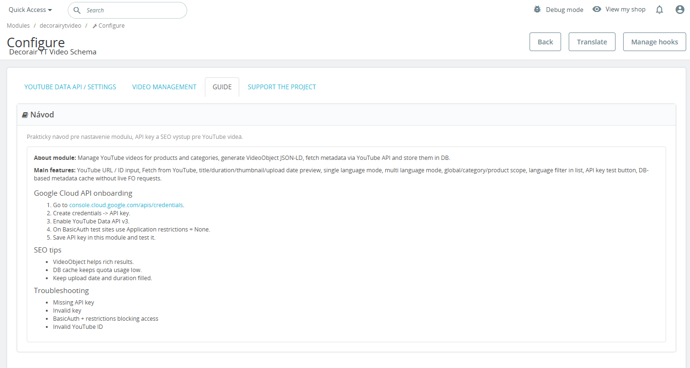
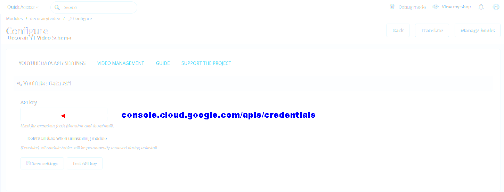
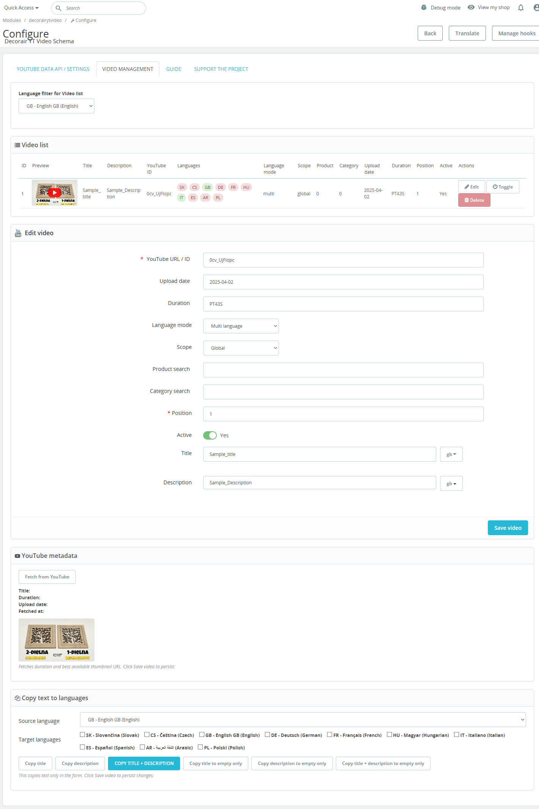

# 🎬 Decorair YouTube SEO (PrestaShop 8)

Powerful PrestaShop 8 module for managing YouTube videos across products and categories with automatic **VideoObject schema (JSON-LD)** for better SEO and rich results.

---
## 📥 Download

👉 **Download this file:**  
👉 **`decorairytvideo-v2.4.11.zip`**

---

### ⚠️ Do NOT use:

- ❌ Source code (zip)
- ❌ Source code (tar.gz)

These files are automatically generated by GitHub and are **NOT installable in PrestaShop**.

## 🚀 Features

- 🎥 Assign YouTube videos to **products, categories or globally**
- 🌍 **Multilingual support** (different video per language)
- ⚡ Fetch video metadata via **YouTube Data API v3**
  - title
  - description
  - duration
  - thumbnail
  - upload date
- 🧠 Automatic **VideoObject schema generation (JSON-LD)**
- 📊 Stored metadata in DB → reduces API usage
- 🔍 Language filter in admin video list
- 🧩 Flexible scope:
  - Global
  - Category
  - Product
- 🎛️ Easy-to-use admin interface
- 🧪 Built-in **API key test button**

---

## 🖥️ Screenshots

### Admin – Guide

### Admin – API Settings

### Admin – Video Management

---

## ⚙️ Requirements

- PrestaShop **8.x**
- PHP **7.4+ / 8.x**
- YouTube Data API v3 key

---

## 🔑 YouTube API Setup

1. Go to: https://console.cloud.google.com/apis/credentials
2. Create **API Key**
3. Enable **YouTube Data API v3**
4. (Optional) Set restrictions → for testing use **None**
5. Paste API key into module settings

---

## 📦 Installation

1. Download latest release ZIP  
2. Go to **PrestaShop Admin → Modules → Module Manager**
3. Click **Upload a module**
4. Install **Decorair YouTube SEO**
5. Open module configuration
6. Insert your **YouTube API key**
7. Save settings

---

## 🧪 Usage

1. Go to **Video Management**
2. Add new video:
   - YouTube URL or ID
   - Select language mode
   - Choose scope (global/category/product)
3. (Optional) Fetch metadata from YouTube
4. Save video

💡 Video will automatically:
- appear on frontend (depending on implementation)
- generate **VideoObject schema**

---

## 📈 SEO Benefits

- Enables **Google rich results for video**
- Improves **CTR in search results**
- Structured data fully compliant with **schema.org VideoObject**
- Reduces crawl ambiguity

---

## 🧯 Troubleshooting

- Missing API key → add in settings
- Invalid key → check Google Cloud setup
- Videos not loading → verify YouTube ID
- API blocked → check restrictions or quota

---

## 🛣️ Roadmap

- [ ] Auto-assign videos based on product/category
- [ ] Bulk import (CSV)
- [ ] AI video suggestions 🤖
- [ ] Advanced schema customization

---

## 👨‍💻 Author

**decorair**  
https://www.decorair.com

---

## 📄 License

MIT License

---

## ⭐ Support the project

If this module helps you, consider giving it a ⭐ on GitHub!
